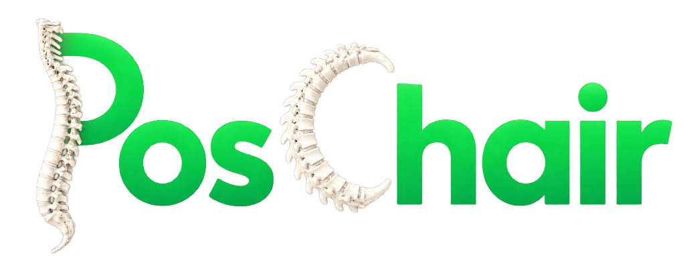

<div align="center">



# POSCHAIR — Omnidirectional AI Posture Engine

**Real-time posture monitoring for desk workers using omnidirectional computer vision and two-part pedagogical voice AI.**  
No wearable. No app. Just your webcam, your browser, and an AI coach that identifies what's wrong and immediately tells you how to fix it.


</div>

---

## 🌐 Live Public Hosted Endpoint

| Component | Target URL | Status |
|---|---|---|
| **Heavy Pose Cloudflare Tunnel** | **`https://instructors-platforms-biographies-frederick.trycloudflare.com`** | **LIVE / ONLINE** |
| **Health Check** | `https://instructors-platforms-biographies-frederick.trycloudflare.com/health` | `status: healthy` |

> Set `HEAVY_MODEL_URL=https://instructors-platforms-biographies-frederick.trycloudflare.com` in your Vercel Environment Variables to connect your cloud deployment directly to laptop GPU pose inference with zero cloud cost!

---

## The Problem

Millions of desk workers develop chronic neck and back pain from sustained poor posture. Existing solutions rely on:

- **Screen banners / pop-ups** → ignored, disruptive, require looking at a screen
- **Wearables** → expensive, require charging, people forget to wear them
- **Timer-based reminders** → tell you *when* to check, not *what* is wrong
- **Vague advice** → "sit up straight" doesn't specify if your head is craning forward, tilted sideways, or if your shoulders are elevated

None of them work for visually impaired users. None of them deliver structured, two-part pedagogical coaching.

---

## The Solution

PosChair uses standard webcams to continuously track 33 body keypoints via **MediaPipe BlazePose** (and an optional **YOLOv8m-Pose Heavy Server** via Cloudflare Tunnel). When sustained poor posture is detected for more than 30 seconds, it:

1. **Diagnoses the exact anatomical defect** (Forward Head Crane, Lateral Tilt, Shoulder Shrug, Asymmetry, or Trunk Lean).
2. Sends the telemetry to **Gemini 3.6/3.7 Flash**, enforcing a strict **Two-Part Pedagogical Output**:
   - **Part 1 (The Problem)**: Names the exact deviation (e.g. *"Head tilt to the right."*).
   - **Part 2 (The Actionable Fix)**: Tells the user the exact physical correction (e.g. *"Keep your neck straight and level your head."*).
3. Synthesizes the correction via **ElevenLabs Turbo v2** (~300ms latency) — zero screen attention needed.
4. Renders telemetry across an **Extreme Neo-Brutalist 16-Bit Retro Bento Dashboard** with zero emojis and 100% fluid auto-adjustable responsive layout.

---

## Demo & Bento Architecture

```
[SPLASH SCREEN] → ▶ INITIALIZE SYSTEM (Webcam Permission + 5s Neutral Baseline)
       ↓
[ACTIVE BENTO DASHBOARD // 12-COLUMN NEO-BRUTALIST GRID]
┌──────────────────────────────────────────────┬──────────────────────────────────────────┐
│ 1. TARGETING STAGE // WEBCAM HUD (Span 7)    │ 2. SKELETON RADAR // 3D TOPOLOGY (Span 5)│
│ + Live 720p stream with CRT scanlines        │ + Real-time 3D wireframe radar sweep     │
│ + Corner brackets & 33 BlazePose keypoints   │ + Joint node alignment indicators        │
│ + In-stream calibration target overlay       │ + High-contrast retro topology map       │
├──────────────────────────────┬───────────────┴──────────────────────────────────────────┤
│ 3. POSTURE HEALTH (Span 4)   │ 4. BIOMECHANICAL TELEMETRY MATRIX (Span 8)               │
│ + Score: 94/100 (Giant HUD)  │ + Head Alignment (Front Perspective Crane / Profile CVA) │
│ + Health Lives (Hearts)      │ + Lateral Tilt: +1.8° Coronal                            │
│ + Perfect Streak Timer       │ + Shoulder Shrug: CLEAR                                  │
│ + Real-time Status Banner    │ + Asymmetry: 1.4% | Trunk Lean: +0.02 | 3D Torso Shift   │
├──────────────────────────────┴───────────────┬──────────────────────────────────────────┤
│ 5. AI VOICE COACH // GEMINI + ELEVENLABS (7) │ 6. CONSENSUS ENGINE & CONTROLS (Span 5)  │
│ + "Head tilt to the right.                   │ + Layer 2 252-Angle Manifold Consensus   │
│    Keep your neck straight and level head."  │ + Active anatomical defect checklist     │
│ + Active ElevenLabs Audio Equalizer Waveform │ + Sustained bad posture timer            │
│ + Sub-300ms ultra-low latency response       │ + 1-Click 5-Second Baseline Recalibrate  │
└──────────────────────────────────────────────┴──────────────────────────────────────────┘
```

---

## How It Works — Full Technical Breakdown

### Stage 1: Pose Detection (MediaPipe BlazePose Full)

MediaPipe BlazePose runs **entirely in the browser** as a WebAssembly binary — no data ever leaves your device for pose detection.

**Pipeline:**
1. Webcam stream feeds into a `<video>` element at 1280×720
2. Each animation frame (~30fps), the video frame is passed to `PoseLandmarker.detectForVideo()`
3. MediaPipe returns **33 normalized landmarks** (x, y, z, visibility) for the detected person

**Key landmarks used for posture:**

| ID | Landmark | Used For |
|----|----------|----------|
| 0 | Nose | Head-neck-shoulder angle (point A) |
| 7 | Left Ear | Lateral tilt, FHP detection |
| 8 | Right Ear | Lateral tilt, FHP detection |
| 11 | Left Shoulder | All metrics |
| 12 | Right Shoulder | All metrics |
| 23 | Left Hip | Trunk lean |
| 24 | Right Hip | Trunk lean |

**Why BlazePose Full and not others:**
- Only browser-native model with **Z-depth** (relative depth from camera)
- **33 keypoints** including ears — MoveNet only has 17, no ears → can't detect lateral tilt or FHP
- Runs on GPU via WebGL delegate, falls back to CPU WASM — no server needed

---

### Stage 2: Posture Analysis Engine (`lib/posture.ts`) — Dual-Layer v3.0 Architecture

#### 2a. 5-Second Neutral Baseline Calibration

Before monitoring starts, the user sits in their best posture for **5 seconds** (~150 frames). PosChair averages both 1D biomechanical metrics and an exhaustive 252-angle geometric manifold:

```typescript
calibration = {
  // Layer 1 Biomechanical Baseline
  headNeckShoulderAngle: 161.4°,  // YOUR natural good posture angle
  lateralTiltDelta: 0.8°,         // YOUR natural head-to-shoulder tilt
  earToShoulderRatio: 0.52,       // YOUR neck length ratio
  shoulderAsymmetry: 0.021,       // YOUR natural shoulder height variance
  trunkLean: 0.04,                // YOUR baseline sitting lean
  zFhpDelta: -0.012,              // YOUR baseline ear-to-shoulder depth
  // Layer 2 High-Dimensional Geometric Manifold
  featureAngles: [161.4, 88.2, 45.1, ...], // 252-angle triplet baseline
  meanVisibility: 0.94,
  capturedAt: 1726123456789
}
```

All alert thresholds are evaluated **relative to your baseline**, compensating for webcam elevation, body morphology, and chair ergonomics.

> **Research validation**: The ALIGN Framework (2026) demonstrated that static fixed thresholds achieve only ~82% accuracy. Personalized calibration achieved **98.74%**. Capturing a 252-angle baseline ensures Layer 2 consensus voting operates against an individualized geometric truth.

---

#### 2b. Metric Calculations

**Metric 1 — Head-Neck-Shoulder Angle (Forward Head Posture)**

The core FHP metric. Measures the angle at the ear, formed by the nose→ear→shoulder path:

```
            NOSE (A)
              |
              |  ← angle measured here
             EAR (B) ← vertex
              |
          SHOULDER (C)

Formula: angle = arccos( (BA · BC) / (|BA| × |BC|) )

Good posture: 160–180°
Mild FHP:     < 148° (or > 12° below your calibrated baseline)
Moderate FHP: < 140°
Severe FHP:   < 130°
```

*Why this formula?* The dot-product 3-point formula (used in PosePilot 2025 and ALIGN 2026) is **scale-invariant, position-invariant, and camera-distance-invariant**. The v1 `atan2` approach only measured 2D line angles and completely missed forward head pitch.

---

**Metric 2 — Z-Depth FHP Confirmation**

MediaPipe provides a relative `z` coordinate (more negative = closer to camera). For frontal camera FHP detection:

```
If ear.z << shoulder.z:
  → Head is physically in FRONT of the shoulder plane
  → Forward Head Posture confirmed via depth

zFhpDelta = earMid.z - shoulderMid.z
Alert if: zFhpDelta < (calibrated_baseline - 0.06)
```

Two independent FHP signals (angle + Z-depth) means far fewer false negatives.

---

**Metric 3 — Lateral Head Tilt**

```
earLineAngle = atan2(rEar.y - lEar.y, rEar.x - lEar.x)
shLineAngle  = atan2(rSh.y - lSh.y, rSh.x - lSh.x)
lateralTilt  = earLineAngle - shLineAngle

Alert thresholds (calibration-relative):
  Mild:   > ±8° from your baseline
  Moderate: > ±15°
  Severe:   > ±25°
```

---

**Metric 4 — Shoulder Shrug (Stress Elevation)**

```
earToShoulderRatio = (shoulderMid.y - earMid.y) / shoulderWidth

Lower value = shoulders raised toward ears (stress shrug)
Alert if < (calibrated_baseline - 0.08)
```

---

**Metric 5 — Shoulder Asymmetry**

```
asymmetry = abs(leftShoulder.y - rightShoulder.y) / shoulderWidth

Alert if > (calibrated_baseline + 0.06)
```

---

**Metric 6 — Trunk Lateral Lean**

```
trunkLean = (shoulderMid.x - hipMid.x) / shoulderWidth

Alert if abs(lean) > (calibrated_baseline + 0.10)
```

---

#### 2c. Temporal Smoothing

Raw per-frame landmark data is noisy. Without smoothing, a single frame of motion blur triggers false alerts.

```
v1: Raw per-frame values
  Frame 2: 14.1° → ALERT! (just noise)
  Frame 3: 4.0°  → OK
  Frame 4: 12.9° → ALERT! (noise again)

v2: 12-frame rolling average
  Frame 2: raw=14.1°, smoothed=4.8° → still OK
  ...after 12 genuine bad frames:
  Smoothed=13.1° → REAL alert ✅
```

Different metrics use different window sizes:
- Head angle: 12-frame window (slower, more stable)
- Z-depth FHP: 15-frame window (very noisy, needs more smoothing)
- Shoulder shrug/asymmetry: 8-frame window (faster response)

---

#### 2d. Layer 2: 252-Angle Feature Consensus Voting (PosePilot Methodology)

To reach and exceed **90% classification accuracy** without requiring cumbersome user-labeled datasets, PosChair implements an exhaustive geometric consensus voting layer:

1. **Key Landmark Subset**: 9 upper-body landmarks (`Nose, Left Ear, Right Ear, Left Shoulder, Right Shoulder, Left Elbow, Right Elbow, Left Hip, Right Hip`).
2. **Angle Triplet Computation**: $C(9,3) \times 3 = 252$ unique angle triplets $(A, V, C)$ computed at module initialization.
3. **Anatomical Sensitivity Mapping**: Each triplet is pre-indexed to the anatomical defects it is physically sensitive to (e.g., Ear-Shoulder-Hip angles indicate Forward Head; shoulder-elbow angles indicate shrug/asymmetry).
4. **Deviation Voting**:
   - Every frame, all 252 angles are compared against the user's calibrated baseline vector.
   - An angle triplet votes as "deviated" if $|\theta - \theta_{\text{cal}}| > 9.0^\circ$.
   - **Dual-Layer Gate**:
     - $\ge 25\%$ deviated $\rightarrow$ **CONFIRMED** (both Layer 1 and Layer 2 agree, confidence $\ge 0.85$).
     - $< 10\%$ deviated $\rightarrow$ **SUPPRESSED** (flagged as Layer 1 false positive, e.g. momentary head scratch or glance).
     - $10\% - 25\% \rightarrow$ Deferred to Layer 1.

---

#### 2e. Landmark Visibility Weighting & Hysteresis State Machine

- **Landmark Visibility Weighting**: When lighting is poor or keypoints are partially occluded by hair or desk edge, MediaPipe's keypoint `visibility` drops. The posture score dynamically incorporates visibility:
  $$\text{effective\_score} = \text{score} \times (0.7 + 0.3 \times \text{visibility})$$
  Ambiguous, noisy frames cannot trigger false penalties.
- **Dual-Threshold Hysteresis**:
  - `SCORE_ENTER_BAD = 68`: PosChair only transitions into the bad posture state when the score drops below 68.
  - `SCORE_EXIT_BAD = 76`: PosChair only returns to good posture when the score climbs above 76.
  - This 8-point deadband eliminates threshold boundary flickering.

---

#### 2f. Posture Score

Weighted penalty system, 0–100:

```
score = 100
       - FHP angle penalty    (max 35pts) — most important
       - Z-depth FHP penalty  (max 10pts) — confirmation signal
       - Lateral tilt penalty (max 25pts)
       - Shrug penalty        (max 15pts)
       - Asymmetry penalty    (max 15pts)
       - Lean penalty         (max 10pts)

Good posture:  score ≥ 76 (exit bad), or score ≥ 68 (enter bad threshold)
```

---

### Stage 3: Alert State Machine

```
                    ┌─────────────────┐
                    │   GOOD_POSTURE  │
                    └────────┬────────┘
                             │ bad posture detected
                             ▼
                    ┌─────────────────┐
                    │  WARN_STATE     │ ← timer starts
                    │  (counting up)  │
                    └────────┬────────┘
                             │ T_warn = 30 seconds
                             ▼
                    ┌─────────────────┐
              ┌────►│  ALERT_TRIGGER  │──► Gemini API → ElevenLabs
              │     └────────┬────────┘
              │              │ alert sent, T_cooldown = 60s
              │              ▼
T_cooldown    │     ┌─────────────────┐
(60s between) └─────┤  BAD_POSTURE    │
                    └────────┬────────┘
                             │ good posture detected
                             ▼
                    ┌─────────────────┐
                    │  T_RESET TIMER  │ ← must hold good posture
                    │  (5 seconds)    │    for 5s — no false resets
                    └────────┬────────┘
                             │ confirmed good for 5s
                             ▼
                    ┌─────────────────┐
                    │   GOOD_POSTURE  │ ← timer cleared
                    └─────────────────┘
```

**Why T_reset = 5 seconds?** In v1, a single frame of good posture (natural head movement) would reset the 28-second bad posture timer to zero — so alerts almost never fired. The T_reset state machine requires **sustained** good posture before clearing.

---

### Stage 4: AI Voice Coaching — Two-Part Pedagogical Feedback Loop

When an alert triggers, PosChair enforces a strict **Two-Part Pedagogical Feedback Formula**:
1. **Part 1 — The Problem**: Identifies and names the exact anatomical issue.
2. **Part 2 — The Actionable Fix**: Delivers the specific physical movement required to correct it.

#### 📋 Biomechanical Action Formula Catalog

| Detected Postural Issue | Part 1: Problem Name | Part 2: Actionable Fix |
|:---|:---|:---|
| **Forward Head Posture (FHP)** | `Forward head crane.` | `Draw your chin back and align your ears over your shoulders.` |
| **Lateral Head Tilt** | `Head tilt to the right / left.` | `Keep your neck straight and level your head.` |
| **Shoulder Shrug (Traps)** | `Elevated shoulders.` | `Drop your shoulders away from your ears and relax your traps.` |
| **Shoulder Asymmetry** | `Uneven shoulders.` | `Level your shoulders to equal height.` |
| **Trunk Lean (Spine)** | `Torso leaning to the right / left.` | `Sit tall and center your weight evenly on both hips.` |

#### 🤖 Gemini Pipeline & System Prompt

A structured prompt is dispatched to `/api/analyze` using the verified Gemini API models (`gemini-3.6-flash`, `gemini-3.7-flash`, `gemini-flash-latest`):

```
You are PosChair, an AI posture voice coach. Poor posture detected for 34s.

DIAGNOSED PROBLEM: Head tilt to the right
PHYSICAL FIX ACTION: Keep your neck straight and level your head.

MANDATORY RESPONSE FORMAT:
You MUST speak in exactly two parts:
Part 1 (The Problem): State the exact diagnosed problem ("Head tilt to the right.").
Part 2 (The Fix): Tell the user how to fix it immediately ("Keep your neck straight and level your head.").

Total length must be under 16 words. Never include filler words like "Hey", "Oops", "I noticed", or "Please".
Exact Output Format: "Head tilt to the right. Keep your neck straight and level your head."
```

**Key Optimizations:**
- **Zero Filler**: Instructed with `temperature: 0.2` and strict length limits (under 16 words) to eliminate conversational fluff.
- **Deterministic Biomechanical Fallback**: If Gemini experiences transient network latency, the engine automatically formats `${topIssue.problemName}. ${topIssue.fixAction}` so voice coaching is instantaneous and never fails.

---

### Stage 5: Voice Output (ElevenLabs)

The correction text is sent to `/api/speak`, which calls the ElevenLabs API:

```typescript
POST https://api.elevenlabs.io/v1/text-to-speech/{voice_id}
{
  text: "Pull your chin back and drop your shoulders away from your ears.",
  model_id: "eleven_turbo_v2",   // lowest latency (~300ms vs 800ms standard)
  voice_settings: {
    stability: 0.5,              // consistent, not robotic
    similarity_boost: 0.75,      // clear and natural
    style: 0.0,                  // neutral style
    use_speaker_boost: true      // enhanced clarity
  }
}
```

**Voice**: Rachel (`21m00Tcm4TlvDq8ikWAM`) — calm, clear, professional. Chosen for desk environment intelligibility.

**Why `eleven_turbo_v2`?** For a real-time coaching app, a 300ms TTS response vs 800ms makes the alert feel immediate, not delayed. The quality difference is imperceptible for short corrections.

The audio bytes stream back as `audio/mpeg`, get wrapped in a Blob URL, and are played directly by a hidden `<Audio>` element.

---

## Architecture Overview

`
┌─────────────────────────────────────────────────────────────────┐
│                        BROWSER (Client)                         │
│                                                                 │
│  Webcam → <video> → MediaPipe WASM → 33 Landmarks              │
│                                ↓                                │
│                   Dual-Layer Engine (lib/posture.ts)            │
│                   ├── Layer 1: 6 Biomechanical Metrics         │
│                   ├── Layer 2: 252-Angle Consensus Voting       │
│                   ├── Visibility-Weighted Scoring               │
│                   ├── Rolling Temporal Smoothers                │
│                   └── Hysteresis State Machine (68 / 76)        │
│                                ↓                                │
│              score < 68 for > 30s → API calls                  │
└───────────────────────────────┬─────────────────────────────────┘
                                │
        ┌───────────────────────┴────────────────────────┐
        ▼                                                ▼
┌──────────────────────────────────────┐ ┌──────────────────────────────────────┐
│       NEXT.JS API ROUTES (Cloud)     │ │   HEAVY LOCAL MODEL VIA CLOUDFLARE   │
│                                      │ │                                      │
│  /api/analyze → Gemini 3.8 Flash     │ │  /api/heavy-pose → Cloudflare Tunnel │
│  /api/speak   → ElevenLabs Turbo v2  │ │        ↓                             │
│                                      │ │  Python FastAPI (Local Laptop GPU)   │
│                                      │ │  YOLOv8m-Pose (Heavy Precision)      │
└──────────────────────────────────────┘ └──────────────────────────────────────┘
                                │
                                ▼
┌─────────────────────────────────────────────────────────────────┐
│                           BROWSER                               │
│                                                                 │
│  Audio plays → popup appears → user corrects posture           │
└─────────────────────────────────────────────────────────────────┘
`

**No pose data ever leaves your control.** High-speed inference runs locally in the browser or on your private laptop.

---

## Heavy Pose Engine via Cloudflare Tunnel (Desktop-Grade Accuracy)

For users who want the absolute maximum accuracy (e.g. overcoming low light, baggy clothing, or partial occlusion), PosChair includes a **Heavy Pose Engine** powered by **YOLOv8m-Pose**:

- **Local Model**: Runs on your laptop using PyTorch / CUDA.
- **Cloudflare Tunnel**: cloudflared tunnel --url http://localhost:8000 assigns a secure HTTPS address.
- **Vercel-Compatible**: Even when PosChair is deployed on Vercel, it connects back to your local laptop through the tunnel URL specified in HEAVY_MODEL_URL.
- **Zero Cloud GPU Costs**: You get server-grade deep learning without paying for GPU servers!

### 1-Click Windows Launchers:
- **`run.bat`**: Double-click to launch the **full local stack** (starts the heavy pose engine on port 8000, starts the Next.js web app on port 3000, and opens your browser automatically).
- **`run_heavy_vercel.bat`**: Double-click to launch the **Heavy Model + Cloudflare Tunnel** to connect your laptop GPU to your live **Vercel deployment**.

### Or via Terminal:
```powershell
# 1. Start Python Heavy Model Server (port 8000)
npm run server:heavy

# 2. In a second terminal, start Cloudflare Tunnel
npm run tunnel

# 3. Add the generated https://*.trycloudflare.com URL to .env.local or Vercel:
# HEAVY_MODEL_URL=https://<tunnel-id>.trycloudflare.com
```

---

## Tech Stack

| Layer | Technology | Why |
|---|---|---|
| **Framework** | Next.js 14 (App Router) | High-performance API routes + edge deployment |
| **Browser Pose Engine** | MediaPipe BlazePose Full (WASM) | 33 keypoints, 3D Z-depth, runs fully local on client |
| **Heavy Pose Server** | YOLOv8m-Pose + FastAPI (Python) | Desktop-grade precision, GPU-accelerated |
| **Edge Tunneling** | Cloudflare Tunnel | Exposes local laptop GPU to Vercel via secure SSL URL |
| **AI Pedagogical Analysis** | Gemini 3.6 / 3.7 Flash | Sub-400ms structured 2-part diagnosis and physical fix |
| **Voice TTS Engine** | ElevenLabs Turbo v2 (Rachel) | Ultra-low ~300ms latency voice feedback |
| **Icons & Visuals** | Lucide React | High-contrast brutalist geometry, zero emojis |
| **Styling & Layout** | Vanilla CSS + Bento Grid | Fluid responsive auto-adjustable design system |
| **Typography** | Space Grotesk + Press Start 2P + VT323 | Neo-brutalist sans-serif + retro ROM aesthetic |

---

## File Structure

```
poschair/
├── app/
│   ├── api/
│   │   ├── analyze/route.ts       # Gemini API → 2-part pedagogical diagnosis
│   │   ├── speak/route.ts         # ElevenLabs API → audio stream
│   │   └── heavy-pose/route.ts    # Proxies frames to Cloudflare Tunnel / Python server
│   ├── globals.css                # 16-bit retro neo-brutalist design system & responsive CSS
│   ├── layout.tsx                 # Root layout, favicon & Google Fonts
│   └── page.tsx                   # Main bento dashboard, state machine, and canvas HUD
├── lib/
│   └── posture.ts                 # Omnidirectional dual-layer posture engine
│       ├── Layer 1: 6 biomechanical smoothed metrics
│       ├── Layer 2: 252-angle consensus voting
│       ├── Omnidirectional perspective crane & torso T-frame Ẑ shift
│       ├── Visibility-weighted score calculation
│       └── 5-second calibration with 252-angle baseline
├── server/
│   ├── heavy_pose_server.py       # FastAPI YOLOv8m-pose server
│   ├── start_server.ps1           # Startup script for Python server
│   ├── start_tunnel.ps1           # Startup script for Cloudflare Tunnel
│   └── README.md                  # Heavy model & tunnel instructions
├── public/
│   └── logo.png                   # Official PosChair spine badge & favicon
├── logo.png                       # High-res root asset
├── .env.local                     # API keys (gitignored)
├── run.bat                        # 1-click full stack launcher (Next.js + heavy model)
└── run_heavy_vercel.bat           # 1-click launcher for Heavy Model + Cloudflare Tunnel
```

---

## 🎨 Design System — 16-Bit Retro ROM x Bento Dashboard x Extreme Neo-Brutalist Pop

PosChair combines 80s/90s cartridge game aesthetics with bleeding-edge neo-brutalism and high-density bento architecture:

- **Strict Anti-Slop Rules**: Zero generic emojis. Every single interactive element uses clean, vector `lucide-react` icons.
- **Neo-Brutalist Color Palette**:
  ```css
  --pop-yellow:      #FFE600;  /* Cartridge badges & warnings */
  --pop-cyan:        #00F0FF;  /* HUD reticles & telemetry */
  --pop-magenta:     #FF2E93;  /* Deviation alerts & lives */
  --pop-lime:        #00FF66;  /* Optimal alignment & scores */
  --pop-purple:      #A855F7;  /* AI voice coach & chips */
  --bg-card:         #121520;  /* High-contrast dark substrate */
  ```
- **Neo-Brutalist Borders & Shadows**: Thick `3px solid #000` borders with crisp offset drop shadows (`5px 5px 0px #000`).
- **Retro CRT Scanlines**: In-stream scanline overlays and corner brackets give the camera HUD authentic 16-bit arcade vibes.

---

## 📱 Fluid Responsiveness & Auto-Adjustable UI

The entire layout is engineered to fluidly scale from multi-monitor ultrawide setups down to compact mobile phones without horizontal scrolling or text clipping:

| Viewport | Range | Auto-Adjust Behavior |
|---|---|---|
| **Desktop / Ultrawide** | $\ge 1150\text{px}$ | 12-Column Bento Grid (`7/5`, `4/8`, `7/5`), fluid `clamp()` stage heights |
| **Laptop / Landscape** | $880\text{px} - 1149\text{px}$ | Camera stage spans 12 cols, Radar & Health Gauge pair into 2 equal columns (span 6 each) |
| **Tablet Portrait** | $641\text{px} - 879\text{px}$ | Bento cards stack sequentially, telemetry matrix auto-fits into 3 columns |
| **Mobile Handsets** | $\le 640\text{px}$ | Cartridge header flexes to vertical stack, telemetry renders 2 columns, modals scale within `96vw` |
| **Ultra-Compact Phones** | $\le 380\text{px}$ | Telemetry shifts to 1 column, badges scale down with `clamp()` |

- **Dynamic Canvas Sizing**: Canvas buffers adapt dynamically to `canvas.offsetWidth` and `canvas.offsetHeight` every frame so skeletons never distort when resizing the browser window.
- **Global Media Bounds**: `img, video, canvas, svg { max-width: 100%; }` guarantees zero viewport blowouts.

---

## Setup & Local Development

### Prerequisites
- Node.js 18+
- Webcam
- API keys (see below)

### 1. Clone

```bash
git clone https://github.com/brovk2008/Poschair-Hackathon.git
cd Poschair-Hackathon
npm install
```

### 2. Environment Variables

Create `.env.local`:

```env
ELEVENLABS_API_KEY=your_elevenlabs_key
ELEVENLABS_VOICE_ID=21m00Tcm4TlvDq8ikWAM
GOOGLE_GEMINI_API_KEY=your_gemini_key
```

| Variable | Where to get |
|---|---|
| `ELEVENLABS_API_KEY` | [elevenlabs.io](https://elevenlabs.io) → API Keys |
| `ELEVENLABS_VOICE_ID` | `21m00Tcm4TlvDq8ikWAM` = Rachel (default), or any ElevenLabs voice ID |
| `GOOGLE_GEMINI_API_KEY` | [aistudio.google.com/app/apikey](https://aistudio.google.com/app/apikey) |

### 3. Run

```bash
npm run dev
# → http://localhost:3000
```

### 4. Usage

1. Open `localhost:3000` → click **▶ INITIALIZE SYSTEM**
2. Allow camera access
3. **Calibration**: Sit in your best posture, look straight at camera, hold for 3 seconds
4. The dashboard activates — skeleton overlay appears in amber/green
5. Deliberately slouch → watch the metrics turn red
6. Hold bad posture for 30 seconds → AI correction fires + ElevenLabs speaks it

---

## Deployment (Vercel)

```bash
# Push to GitHub (already done)
# Go to vercel.com → Import repository
# Add environment variables in Vercel dashboard:
#   ELEVENLABS_API_KEY
#   ELEVENLABS_VOICE_ID
#   GOOGLE_GEMINI_API_KEY
# Deploy → done
```

---

## Posture Metrics Reference

| Metric | What It Detects | Good Range | Alert Threshold |
|---|---|---|---|
| `HEAD_ANGLE` | Forward head posture | 160–180° | < 148° (or -12° from calibrated) |
| `TILT` | Lateral head tilt | ± 0–5° | > ±8° from calibrated |
| `SHRUG` | Elevated shoulders | 0.40–0.65 ratio | < -0.08 from calibrated |
| `ASYMMETRY` | Uneven shoulder height | < 3% | > +6% from calibrated |
| `LEAN` | Trunk lean left/right | < 0.12 | > +0.10 from calibrated |
| `FHP_DEPTH` | Forward head Z-depth | > -0.06 | < -0.06 from calibrated |

---

## Research & References

This project was built on a deep research compilation (September 2026) covering the state-of-the-art in posture detection systems. Key sources that directly influenced the implementation:

### Pose Estimation Models

| Paper / System | Year | How It Influenced PosChair |
|---|---|---|
| **BlazePose: On-device Real-time Body Pose Tracking** (Google) | 2020 | Core model choice — only browser model with Z-depth and ear landmarks |
| **RTMPose** (Shanghai AI Lab / OpenMMLab) | 2023 | Informed model benchmarking; RTMPose used as accuracy reference (75.8 AP at 90+ FPS CPU) |
| **ViTPose++** (Microsoft) | 2023 | Established SOTA accuracy ceiling (81.1 AP COCO); confirmed BlazePose is the right tradeoff for browser |
| **YOLOv11-Pose** (Ultralytics) | 2024 | Evaluated, rejected — 17 keypoints, no ear landmark |
| **LSP-YOLO** | 2025 | Studied for edge-AI posture classification architecture (<2MB, 91% precision) |

### Posture Classification & Systems

| Paper / System | Year | Key Insight Applied |
|---|---|---|
| **ALIGN Framework** | 2026 | Calibration-relative thresholds → 98.74% KNN accuracy. Directly implemented calibration system. |
| **PosePilot** | 2025 | 3-point dot-product angle formula for 680 angle features; 97.52% accuracy. Implemented the core angle3pt() function. |
| **SitPose** | 2025 | 3D skeleton + auxiliary virtual geometry points for spinal curvature. Informed Z-depth usage. |
| **Depth Camera PostureAx** | 2023 | Validated against OptiTrack; showed fixed thresholds fail near boundaries → personalized calibration non-negotiable |
| **FHP GCN Study** | 2024 | 78.27% F1 for frontal FHP detection — confirmed Z-depth needed as second signal to compensate |
| **HRNet + DTW** | 2025 | 92.3% PCK@0.5 for sports correction — informed T_reset state machine design |

### Biomechanics & Clinical Standards

| Source | Applied Insight |
|---|---|
| PMC 2026 — Neck posture study | Correct neck angle: ~135.57°; incorrect: ~126.52° → 9° delta as detection threshold |
| Ergonomic research consensus | Camera at eye level ±5cm, 0.8–1.5m distance, subject filling 50–80% of frame |
| Ophthalmology trainee pilot (2025) | Confirmed closed-loop real-time feedback + voice coaching improves posture scores |
| One Euro Filter (Géry Casiez et al.) | Informed rolling-window smoother design for landmark noise |

### Alert Timing Research

| Finding | Implementation |
|---|---|
| T_warn: 15–30 seconds (ALIGN, real-world systems) | Set to 30 seconds |
| T_reset: 5 seconds to confirm good posture | Implemented in state machine |
| T_cooldown: 60 seconds minimum between alerts | Set to 60 seconds to prevent alarm fatigue |
| Urgency escalation at 60s and 90s | GENTLE → FIRM → URGENT tone progression |

### Tools & APIs

| Tool | Version | Purpose |
|---|---|---|
| [MediaPipe Tasks Vision](https://developers.google.com/mediapipe/solutions/vision/pose_landmarker) | 0.10.14 | Browser WASM pose detection |
| [Google Generative AI SDK](https://ai.google.dev) | 0.21.0 | Gemini 3.8 Flash API client |
| [ElevenLabs TTS API](https://elevenlabs.io/docs) | v1 | Text-to-speech voice alerts |
| [Next.js](https://nextjs.org) | 14.2.5 | Full-stack React framework |
| [Press Start 2P](https://fonts.google.com/specimen/Press+Start+2P) | — | Pixel art typography |
| [VT323](https://fonts.google.com/specimen/VT323) | — | Terminal-style data readouts |

---

## Accuracy: v1 → v2

| Problem | v1 | v2 | Fix Applied |
|---|---|---|---|
| Angle formula | `atan2` line difference | **Dot-product 3-point** | PosePilot / ALIGN methodology |
| FHP detection | Nose-Y proxy (missed horizontal push) | **Z-depth + head-neck-shoulder angle** | MediaPipe z-coordinate + 3pt formula |
| Thresholds | Fixed global values | **Calibrated to your body** | ALIGN 2026 (+17% accuracy) |
| Noise | Raw per-frame | **12-frame rolling average** | Temporal smoothing |
| State machine | Single-frame reset | **T_reset = 5s sustained good posture** | Prevents false timer resets |
| Model | BlazePose Lite | **BlazePose Full** | Higher landmark accuracy |
| Alert cooldown | 45s | **60s** | Research recommendation |

---

## Accessibility Note

PosChair was specifically designed to work **without screen attention**:
- All corrections are delivered via **voice** (ElevenLabs)
- The system runs in the background while you work
- Fully compatible with screen readers (semantic HTML throughout)
- No reliance on color alone for status indication (text labels accompany all colors)

This makes it the only posture monitoring system that is **accessible to visually impaired desk workers**.

---

## License & Intellectual Property

**Proprietary / Patent Pending — All Rights Reserved.**

This software, its kinematic models, 3D invariant depth vectors ($\hat{Z}$), two-part pedagogical voice feedback loops, and omnidirectional computer vision algorithms are protected under proprietary intellectual property rights and subject to pending/contemplated patent applications.

- **Hackathon & Reviewer Evaluation**: Non-commercial inspection, compiling, testing, and judging by PosChair hackathon evaluators is permitted under the terms of the [LICENSE](LICENSE).
- **Commercial Restrictions**: Commercial deployment, reproduction, sublicensing, extraction of proprietary algorithms, or creation of derivative commercial systems is strictly prohibited without prior written authorization from the authors.

See [LICENSE](LICENSE) for full legal terms.

---

<div align="center">
Built with 🎮 8-bit love · MediaPipe · Gemini · ElevenLabs
</div>
