# 📸 PosChair Visual Showcase & Screenshots

This directory contains visual captures of **PosChair** across all major device viewports and system states.

---

## 🌟 Core System Showcase

| Preview | Description |
|---|---|
| 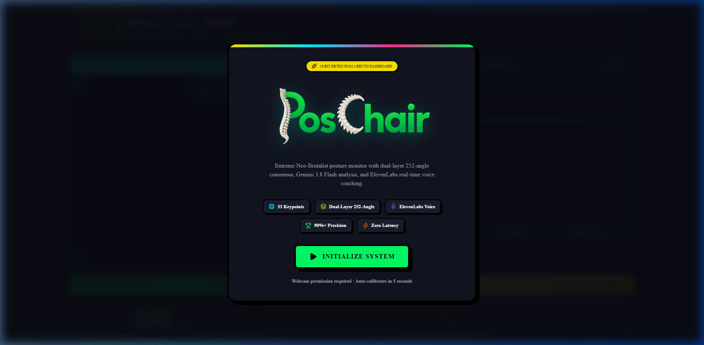 | **01. Splash Hero Screen**: 16-Bit Retro ROM overlay with the official spine logo, brutalist badge, and system launch controls. |
| 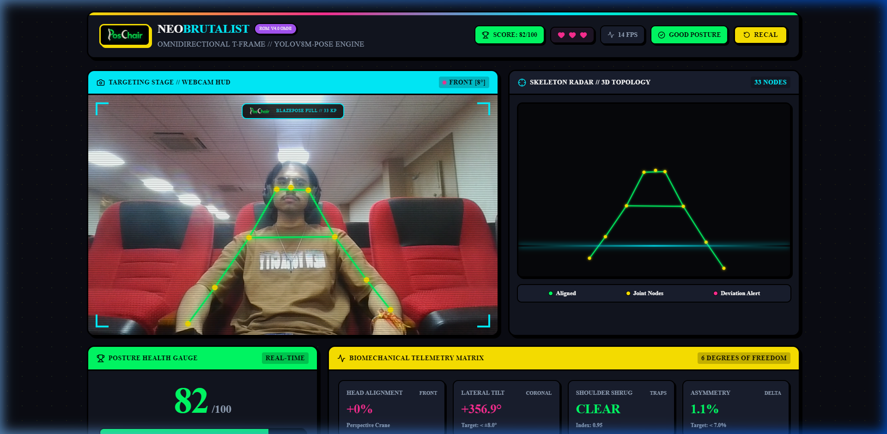 | **02. Active Bento Dashboard**: Full 12-column neo-brutalist grid featuring the live webcam targeting stage, 3D skeleton radar, health score meter, and telemetry matrix. |
| 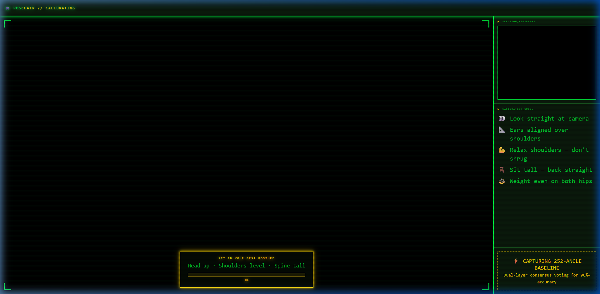 | **03. In-Stream Calibration**: 5-second personal baseline capture with circular ring progress and neutral ergonomic instructions. |
| 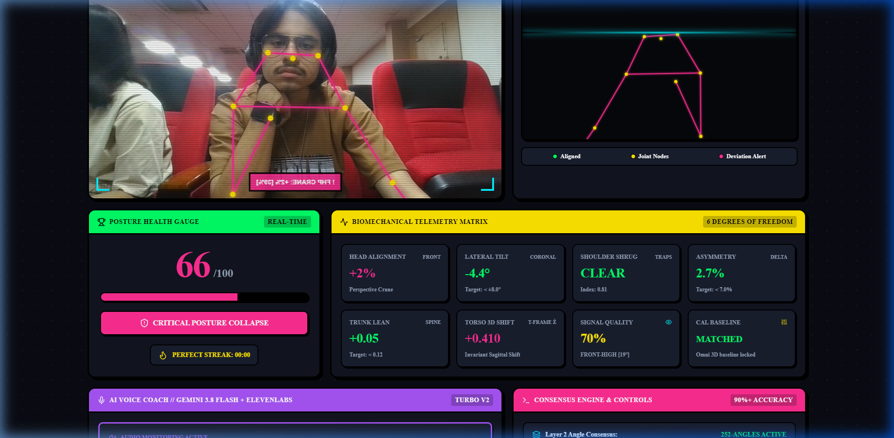 | **04. Biomechanical Telemetry Matrix**: 6-DoF real-time metrics (Perspective Crane Ratio, Lateral Tilt, Shoulder Shrug, Asymmetry, Trunk Lean, 3D Invariant Torso Shift). |
| 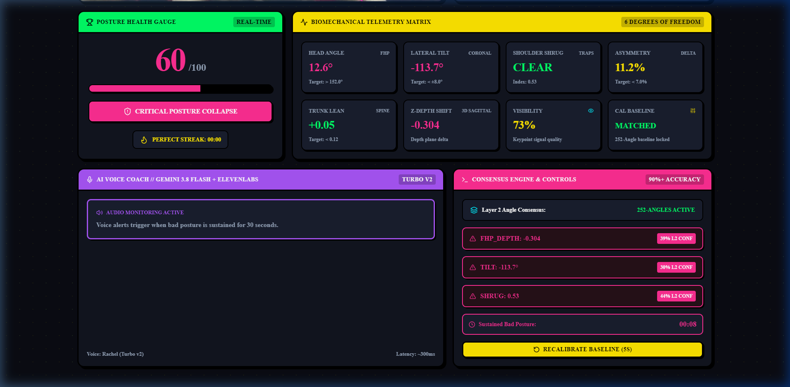 | **05. AI Coach & Consensus Engine**: Two-part pedagogical voice feedback quote box, active ElevenLabs equalizer waveform, and Layer 2 252-angle manifold agreement status. |

---

## 📱 Multi-Device Responsive Breakpoints

| Preview | Device Viewport |
|---|---|
| 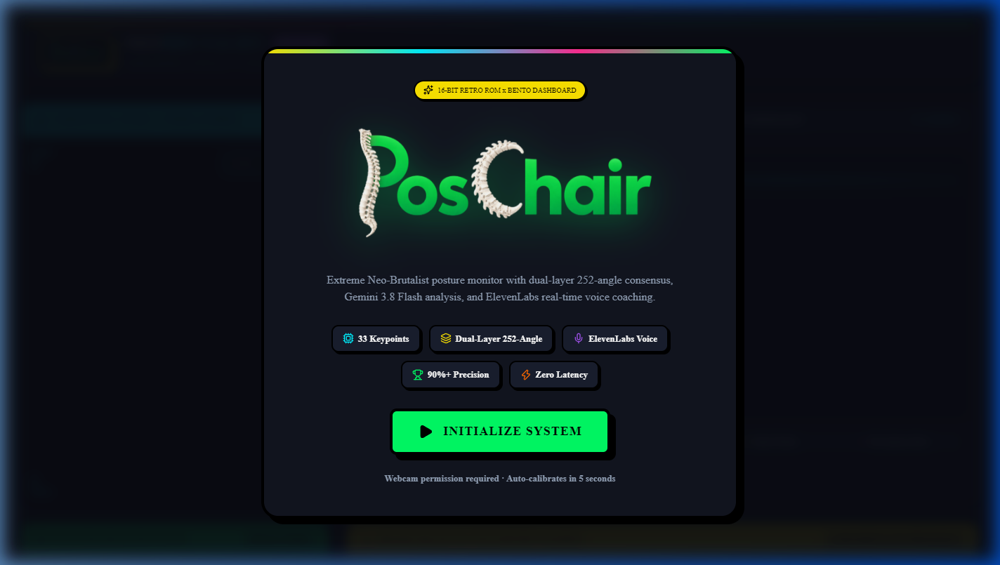 | **Desktop (1440×900)**: Full 12-column layout with fluid camera height. |
| 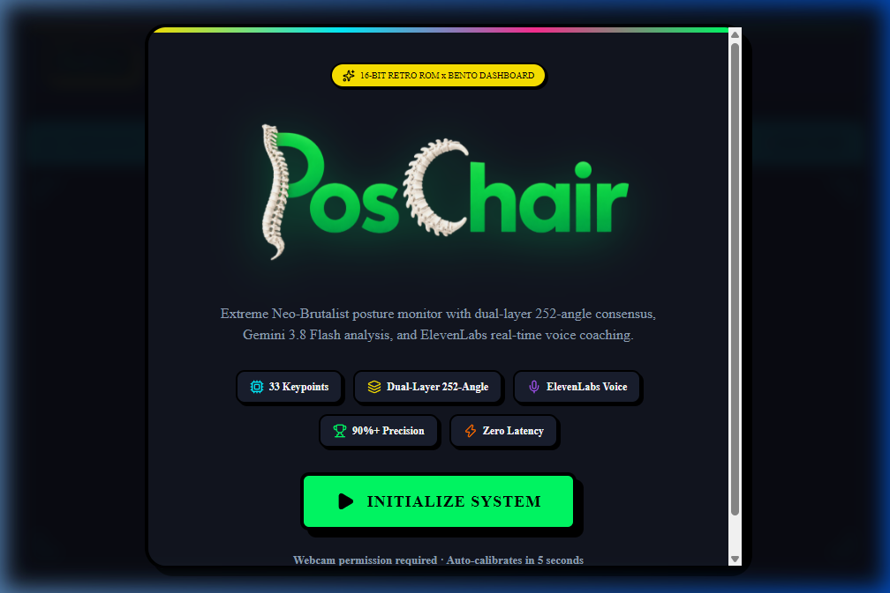 | **Tablet Landscape (1024×768)**: 12-column top stage, balanced 2-column mid-row (span 6 each). |
| 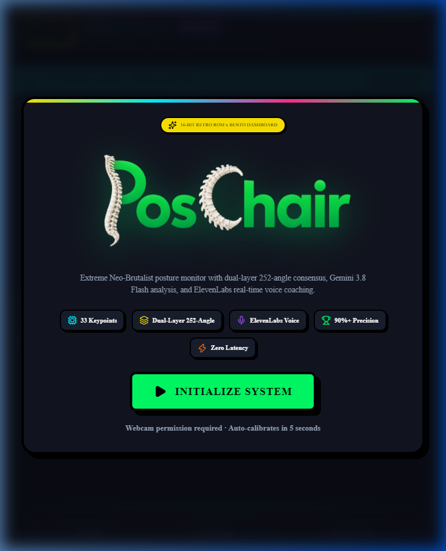 | **Tablet Portrait (768×1024)**: Vertical stacked cards, 3-column telemetry matrix. |
| 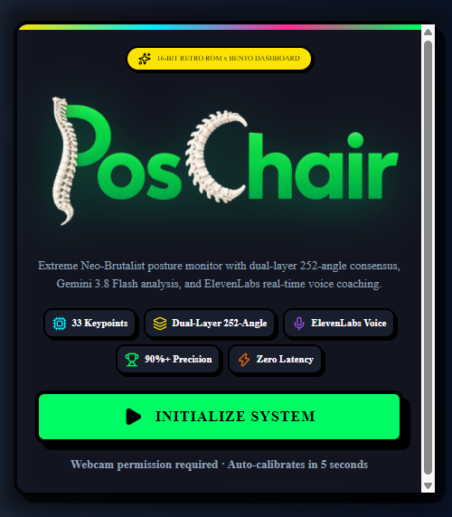 | **Mobile Splash (375×667)**: Centered modal within `96vw` with zero horizontal scrolling. |
| 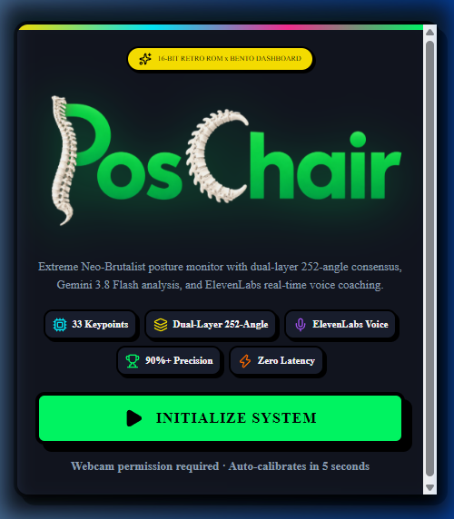 | **Mobile Dashboard (375×667)**: Auto-adjusted 2-column telemetry, stacked cards, fluid canvas HUD. |
|  | **Mobile Camera HUD**: CRT scanlines, mini badge, and scaled corner brackets on narrow viewports. |
| 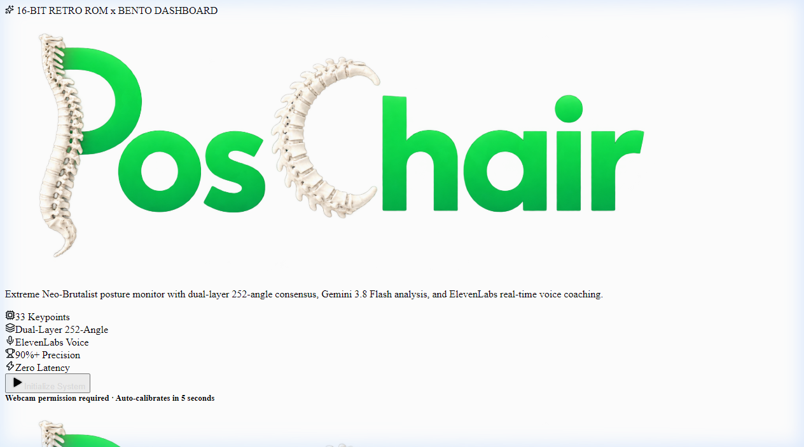 | **Laptop (1280×800)**: Compact desktop view with proportional padding and spacing. |

---

## 🗂️ Raw Captures

All raw test session recordings, frame captures, and inspection screenshots are preserved in the [`raw/`](./raw/) directory.
